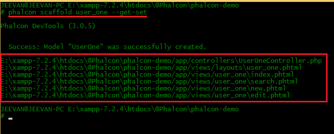

# Phalcon Project

https://github.com/jeevan15498/Phalcon-Project-Demo

## Processing Topics

* Bootstrap CSS framework use /layouts
* include part of footer, header
* ACL (get roles (admin, guest, user) from databases)
* ajax post or get sample
* 404 error for If controller or action not exits. (https://docs.phalcon.io/3.4/en/routing#not-found-paths)
* multi-language support

## Completed Topics

* Bootstrap CSS framework use `/layouts` without use footer, header files

    | User Types | Routes | Layout File |
    | ---------- | ------ | ----------- |
    | Guest | `/` | `app\views\layouts\guestLayout.volt` |
    | User |  `/admin` | `app\views\layouts\userLayout.volt` |
    | Admin | `/user` | `app\views\layouts\adminLayout.volt` |

* ACL (get roles (admin, guest, user) from databases)
    - https://docs.phalcon.io/3.4/en/tutorial-base#designing-a-sign-up-form
    - Design Login and Sign Up Template `(User Role = 1, Admin Role = 2)`
    - Create a new database in phpmyadmin `phalcon-demo`
    - Create a new database table `users` in the `phalcon-demo` database
        ```sql
        CREATE TABLE `users` (
        `id` int(11) NOT NULL AUTO_INCREMENT,
        `name` text NOT NULL,
        `email` text NOT NULL,
        `password` text NOT NULL,
        `role` text NOT NULL,
        `active` int(11) NOT NULL DEFAULT '0',
        `created` text NOT NULL,
        `updated` text NOT NULL,
        PRIMARY KEY (`id`)
        ) ENGINE=InnoDB AUTO_INCREMENT=0 DEFAULT CHARSET=latin1   
        ```
    - Set database in the phalcon `app/config/config.php` file
    - Create `users` model in phalcon shell `'phalcon create-model users --get-set --mapcolumn'`
    - https://docs.phalcon.io/3.4/en/validation#validation
    - Update Validation Class Name in users model
    - Check Signup Form
    - Create Login Method in `IndexController.php` file
    - https://docs.phalconphp.com/en/3.3/session#start

* Ajax post or get sample (API)
    - Firstly create a API Controller file using `Phalcon DevTools: phalcon create-controller API`
    - Read: https://docs.phalcon.io/3.4/en/routing#http-method-restrictions
    - Read: https://docs.phalcon.io/3.4/en/request
    - Read: https://docs.phalcon.io/3.4/en/response.html
    - Make API Controller
    - API Status Code
        * https://www.restapitutorial.com/httpstatuscodes.html
        * https://documentation.commvault.com/commvault/v11_sp14/article?p=45599.htm
    
        | Code | Status | Description |
        | ---- | ------ | ----------- |
        | 200 | OK | The request was successfully completed. |
        | 201 | Created | A new resource was successfully created. |
        | 400 | Bad Request | The request was invalid. |
        | 401 | Unauthorized | The request did not include an authentication token or the authentication token was expired. |
        | 403 | Forbidden | The client did not have permission to access the requested resource. |
        | 404 | Not Found | The requested resource was not found. |
        | 405 | Method Not Allowed | The HTTP method in the request was not supported by the resource. For example, the DELETE method cannot be used with the Agent API. |
        | 409 | Conflict | The request could not be completed due to a conflict. For example,  POST ContentStore Folder API cannot complete if the given file or folder name already exists in the parent location. |
        | 500 | Internal Server Error | The request was not completed due to an internal error on the server side. |
        | 503 | Service Unavailable | The server was unavailable. |
    - Test API on this Application `https://insomnia.rest/`

* Putting the Access Control List in the Database - Step 1
    - Read: https://www.learnphalcon.com/post/show/9/putting-the-access-control-list-in-the-database---step-1
    - Create `Four` Database Tables
        1. `dbrole`
        ```sql
        CREATE TABLE `dbrole` (
            `role` varchar(40) NOT NULL,
            `description` varchar(160) NOT NULL,
            PRIMARY KEY (`role`)
        ) ENGINE=InnoDB DEFAULT CHARSET=latin1
        ```
        2. `dbresource`
        ```sql
        CREATE TABLE `dbresource` (
            `resource` varchar(40) NOT NULL,
            PRIMARY KEY (`resource`)
        ) ENGINE=InnoDB DEFAULT CHARSET=latin1
        ```
        3. `dbaction`
        ```sql
        CREATE TABLE `dbaction` (
            `resource` varchar(40) NOT NULL,
            `action` varchar(40) NOT NULL,
            PRIMARY KEY (`resource`,`action`)
        ) ENGINE=InnoDB DEFAULT CHARSET=latin1
        ```
        4. `dbaccesscontrollist`
        ```sql
        CREATE TABLE `dbaccesscontrollist` (
            `role` varchar(40) NOT NULL,
            `action` varchar(40) NOT NULL,
            `resource` varchar(40) NOT NULL,
            PRIMARY KEY (`role`,`action`,`resource`)
        ) ENGINE=InnoDB DEFAULT CHARSET=latin1
        ```
    - Insert User Role in the `dbrole` database table
    ```sql
    insert into dbrole values('Registered User', 'Registered User privileges, granted after sign in.');
    insert into dbrole values('Guest','Anyone browsing the site who is not signed in is considered to be a "Guest".');
    insert into dbrole values('Admin','Administrator - can do everything');
    ```
    - Create models for the `dbrole`, `dbresource` and `dbaction` tables but do a full **scaffold** on the `dbaccesscontrollist` table.
    ```cmd
    phalcon model dbrole --get-set --namespace=security
    phalcon model dbresource --get-set --namespace=security
    phalcon model dbaction --get-set --namespace=security
    ```
    ```cmd
    phalcon scaffold dbaccesscontrollist --get-set --ns-models=security
    ```
    - Open file `/app/config/loader.php` and Insert `security` **Namespace**
    ```php
    $loader->registerNamespaces(
        [
            "security" => $config->application->modelsDir
        ]
    );
    ```
    - Then Update `Dbaccesscontrollistcontroller.php` File in the controller folder and create view file

* Access Control List in the Database - Step 2
    - Now that the roles, resources, actions and access control list are stored in the database we need to modify the Security Plugin to use this information rather than hard-coding this information directly into the Security Plugin PHP file itself.
    - Read: https://www.learnphalcon.com/post/show/10/putting-the-access-control-list-in-the-database---step-2
    - Create new folder `apps/plugins` and Create `SecurityPlugin.php` File
    - Register Plugins Path in `app\config\loader.php` File
        ```php
        $config->application->pluginsDir,
        ```
    - To get the Security Plugin working you need to add some code to the `app/config/services.php` file.
        ```php
        use Phalcon\Mvc\Dispatcher as Dispatcher;
        use Phalcon\Events\Manager as EventsManager;
        ```
        ```php
        $di->set('dispatcher', function () use ($di) {
            $eventsManager = new EventsManager;
            // Check if the user is allowed to access certain action using the SecurityPlugin
            $eventsManager->attach('dispatch:beforeDispatch', new SecurityPlugin);
            // Handle exceptions and not-found exceptions using NotFoundPlugin
            // $eventsManager->attach('dispatch:beforeException', new NotFoundPlugin);
            $dispatcher = new Dispatcher();
            $dispatcher->setEventsManager($eventsManager);
            return $dispatcher;
        });
        ```
    - Create new controller file `ErrorsController.php` and create view files
    - All roles should be able to access all actions of the Errors Controller all the time.
    - Update User Session Data and update `\app\views\index\login.volt`, `app\views\index\signup.volt` file
    - Insert User Logout method in index controller and given all user role permission
    - Update User Role in the database `users` table

## Another Features

### Create a model, controller and views with phalcon-tools. 

https://www.learnphalcon.com/post/show/11/user-login---step-1

```cmd
phalcon scaffold user --get-set

phalcon scaffold user --get-set --ns-models=namespaceName
```

